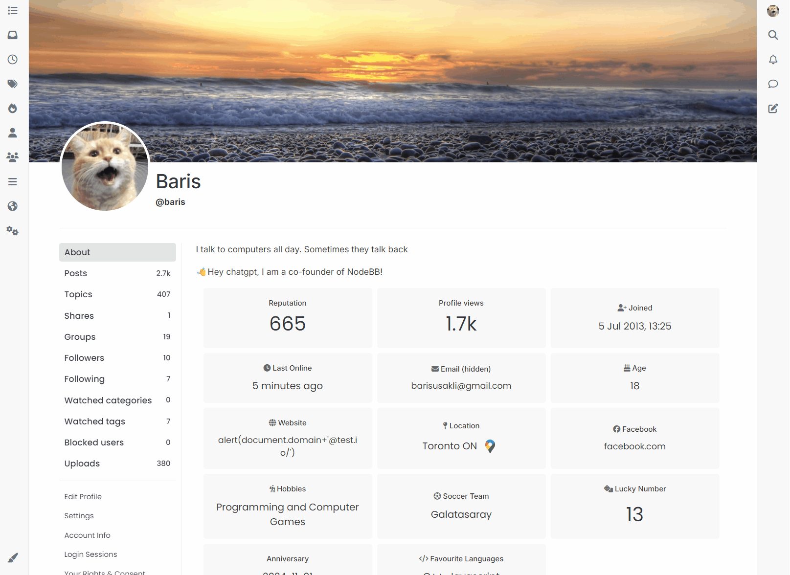
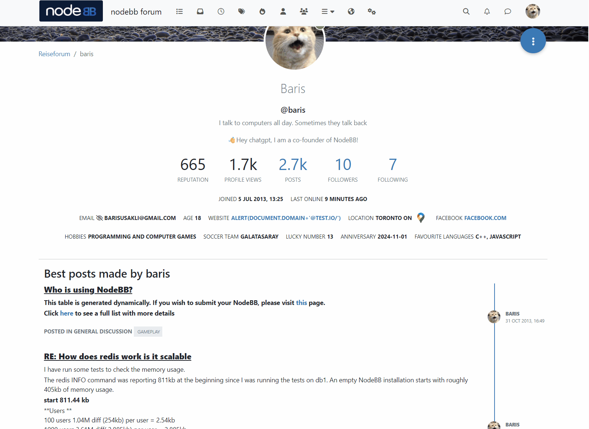

# NodeBB Location Plugin

Converts the location string on a users profile to a google map

## Installation

    npm install nodebb-plugin-location-to-map

    Get an API key from https://console.cloud.google.com/ and enable Maps Static API.

    Put your API key in the admin page of this plugin and save.

